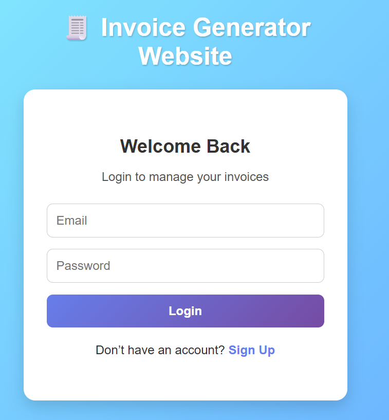
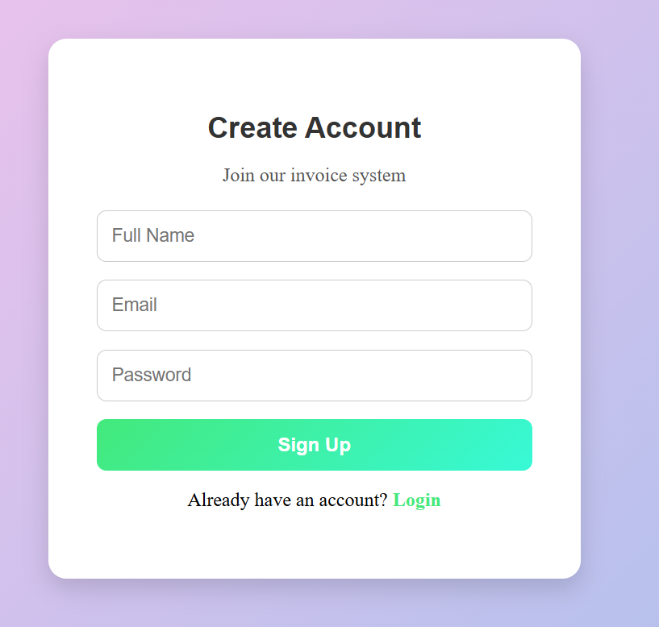
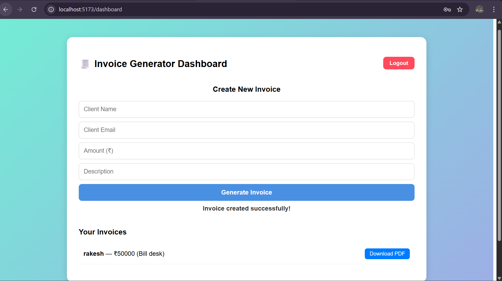

🧾 Invoice Generation Website

👨‍🏫 Note for Teacher 

This project uses MongoDB Atlas (Cloud) for database storage.

The .env file is already included for easy local testing.

The database is accessible to all IPs (0.0.0.0/0),

so you can run the project directly without any extra configuration.

🧩 Steps to Run

1️⃣ Start Backend

cd backend

npm install

node server.js

You should see:

Server running on port 5000

MongoDB Connected: ac-hsak9nv-shard-00-00.yylv83r.mongodb.net

2️⃣ Start Frontend

cd ../frontend

npm install

npm run dev

Then open the link shown (like http://localhost:5173/) in a browser.

A Full-Stack Web Application that allows users to register, log in, create, view, and download invoices as PDF files — built using React, Node.js, Express.js, and MongoDB.

#Project Overview

The Invoice Generation Website simplifies billing by allowing users to securely sign up, log in, and generate invoices digitally.
Each invoice can be downloaded as a PDF, and all data is stored securely in a MongoDB Atlas cloud database.

This project demonstrates:

Integration of frontend (React) and backend (Node.js)

RESTful APIs with authentication

Use of JSON Web Tokens (JWT)

Database connectivity with Mongoose

Dynamic PDF generation

🗂️ Folder Structure
invoice-generator-app/
│
├── backend/
│   ├── config/              # Database connection setup
│   │   └── db.js
│   ├── controllers/         # All backend logic
│   │   ├── authController.js
│   │   └── invoiceController.js
│   ├── middleware/          # Middleware (JWT verification)
│   │   └── authMiddleware.js
│   ├── models/              # MongoDB schemas
│   │   ├── User.js
│   │   └── Invoice.js
│   ├── routes/              # API routes
│   │   ├── authRoutes.js
│   │   └── invoiceRoutes.js
│   ├── utils/               # Helper files (PDF, tokens)
│   │   ├── generateToken.js
│   │   └── generatePDF.js
│   ├── server.js            # Entry point for backend
│   └── package.json
│
├── frontend/
│   ├── public/
│   │   └── vite.svg
│   ├── src/
│   │   ├── pages/           # React pages (Login, Signup, Dashboard)
│   │   ├── context/         # Global Auth state management
│   │   ├── services/        # Axios setup for API calls
│   │   ├── App.jsx
│   │   └── main.jsx
│   ├── index.html
│   └── package.json
│
├── .gitignore
├── README.md
└── test.http

⚙️ How to Run Locally
1️⃣ Clone the Repository
git clone https://github.com/shiv0666/IFSD-project--Invoice-generation-website.git
cd IFSD-project--Invoice-generation-website

2️⃣ Backend Setup

Go to the backend folder:

cd backend
npm install

Create a .env file in the backend folder and add:

MONGO_URI=your_mongodb_connection_string
JWT_SECRET=your_secret_key
PORT=5000

Start the backend server:

node server.js

If successful, you’ll see:

Server running on port 5000
MongoDB Connected: ...

3️⃣ Frontend Setup

Open a new terminal:

cd ../frontend
npm install
npm run dev

Your frontend will run on:

http://localhost:5173/

🧩 Features
Feature	Description
| Feature                 | Description                                        |
| ----------------------- | -------------------------------------------------- |
| 🧍 User Authentication  | Secure signup and login using JWT                  |
| 🔒 Protected Routes     | Dashboard and invoice endpoints require login      |
| 🧾 Invoice Management   | Create, view, and manage invoices                  |
| 📄 PDF Generation       | Download invoices as professional PDF files        |
| ☁️ Database Integration | All data stored in MongoDB Atlas                   |
| 🎨 Modern UI            | Clean and responsive React-based frontend          |
| ⚙️ API Integration      | Seamless frontend-backend connectivity using Axios |

🧠 Tech Stack
| Layer              | Technology                       |
| ------------------ | -------------------------------- |
| **Frontend**       | React (Vite), Axios, Context API |
| **Backend**        | Node.js, Express.js              |
| **Database**       | MongoDB Atlas                    |
| **Authentication** | JSON Web Tokens (JWT)            |
| **PDF Generation** | PDFKit                           |
| **Styling**        | CSS, Inline Styling              |
| **Tools**          | Git, VS Code, Postman            |

🔗 API Endpoints
| Method | Endpoint             | Description         |
| ------ | -------------------- | ------------------- |
| POST   | `/api/auth/register` | Register a new user |
| POST   | `/api/auth/login`    | Login existing user |

🧾 Invoice Routes (Protected)
| Method | Endpoint                | Description             |
| ------ | ----------------------- | ----------------------- |
| POST   | `/api/invoices`         | Create a new invoice    |
| GET    | `/api/invoices`         | Fetch user invoices     |
| GET    | `/api/invoices/:id/pdf` | Download invoice as PDF |

🧭 Usage Flow

1️⃣ User Registers → account stored in MongoDB.
2️⃣ User Logs in → receives a JWT token.
3️⃣ Token is stored in frontend (via Context API).
4️⃣ User creates invoices via the dashboard form.
5️⃣ Invoices are fetched and displayed from the backend.
6️⃣ Clicking “Download PDF” triggers PDFKit to generate and download the file.

🖼️ Screenshots
## 🖼️ Screenshots

| Page | Screenshot |
|------|-------------|
| **Login Page** |  |
| **Signup Page** |  |
| **Dashboard Page** |  |

💻 Common Commands
Run Backend
cd backend
node server.js

Run Frontend
cd frontend
npm run dev

Push Updates to GitHub
git add .
git commit -m "Updated project files"
git push

🔒 .gitignore (Important)

Ensure your .env file is NOT uploaded to GitHub.

Your .gitignore should contain:

node_modules
.env
.vscode
.DS_Store

💡 Future Improvements

✅ Add user profile section
✅ Add invoice status tracking (Paid / Pending)
✅ Add invoice analytics dashboard
✅ Implement dark/light mode
✅ Enable invoice sharing via email

👨‍💻 Author

👤 Name: Shivansh Lohani
🎓 Branch: Computer Science & Engineering (Undergraduate)
📧 Email: shivanshlohani263166@gmail.com.com

🌐 GitHub: shiv0666
